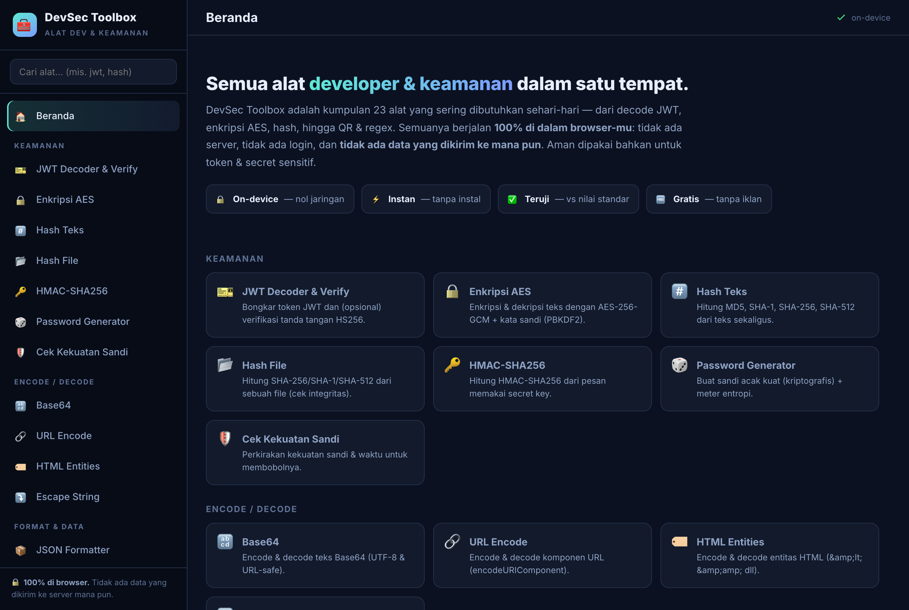
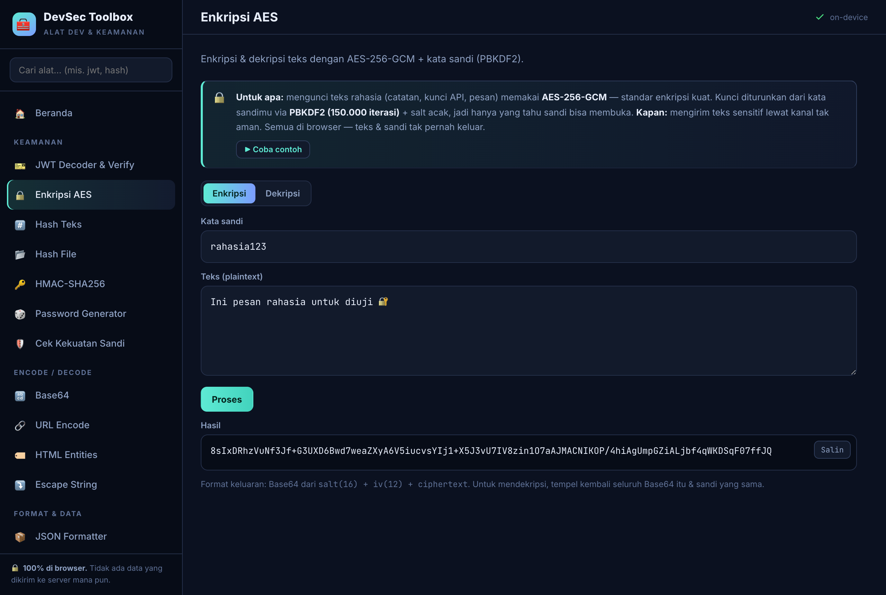

# 🧰 DevSec Toolbox

### 23 alat developer & keamanan — semuanya berjalan **100% di browser**, tanpa server.

**[▶ Buka DevSec Toolbox](https://ksatriabintangsamudra.my.id/devsec/)**

---

Kumpulan lengkap alat harian untuk **developer, analis, dan security enthusiast** — tanpa instal, tanpa login, **tanpa kirim data**. Tiap alat dilengkapi penjelasan **"untuk apa & kapan dipakai"** dan tombol **contoh**, sehingga pengunjung langsung paham tujuannya. Aman bahkan untuk token & secret sensitif karena semuanya diproses di perangkatmu.

## 🧩 23 Alat, 5 Kategori

| Kategori | Alat |
|---|---|
| **🔐 Keamanan** | **JWT Decoder & Verify** (verifikasi tanda tangan HS256) · **Enkripsi AES-256-GCM** (PBKDF2) · Hash Teks (MD5/SHA-1/256/512) · **Hash File** · HMAC-SHA256 · Password Generator · **Cek Kekuatan Sandi** |
| **🔡 Encode / Decode** | Base64 (UTF-8 & URL-safe) · URL · HTML Entities · Escape String |
| **📦 Format & Data** | JSON Formatter · Regex Tester · **Diff Teks** · Konversi Basis Angka |
| **🎲 Generator** | UUID v4 · **QR Code** (unduh PNG) · Lorem Ipsum |
| **🧭 Konversi** | Timestamp · **Cron Parser** (5 jadwal berikutnya) · URL Parser · Teks & Kasus · Warna (HEX/RGB/HSL) |

## ✅ Benar-benar valid — bukan asal jadi

Setiap alat diuji terhadap **nilai/vektor standar**:

- `MD5("abc")` = `900150983cd24fb0d6963f7d28e17f72` · `SHA-256("abc")` = `ba7816bf…f20015ad`
- **AES**: enkripsi → dekripsi kembali persis ke teks asli
- **JWT Verify**: secret benar → **VALID**, secret salah → **ditolak**
- **QR**: hasil di-generate lalu **berhasil dipindai balik** (terbukti scannable)
- **Cron / Base angka / Diff / Timestamp**: dicek dengan kasus yang diketahui hasilnya

## ✨ Kenapa dipakai

- 🔒 **Privat** — nol request jaringan; token, secret, & file tak pernah keluar dari browser.
- 🎯 **Berorientasi tujuan** — tiap alat menjelaskan gunanya + contoh sekali klik.
- ⚡ **Cepat & ringkas** — pencarian alat, tautan langsung (mis. `#jwt`), responsif di HP.

## 🛠️ Teknologi

HTML + CSS + JavaScript **murni**. Kripto memakai **Web Crypto API** (`crypto.subtle`) untuk SHA/HMAC/AES-GCM/PBKDF2; MD5 diimplementasi lokal; UUID & password via `crypto.getRandomValues`; QR via `qrcode-generator` (di-vendor lokal). Hosting statis di GitHub Pages.

---

<b>DevSec Toolbox</b> · dibuat oleh <a href="https://ksatriabintangsamudra.my.id">Ksatria Bintang Samudra</a> · lisensi MIT

