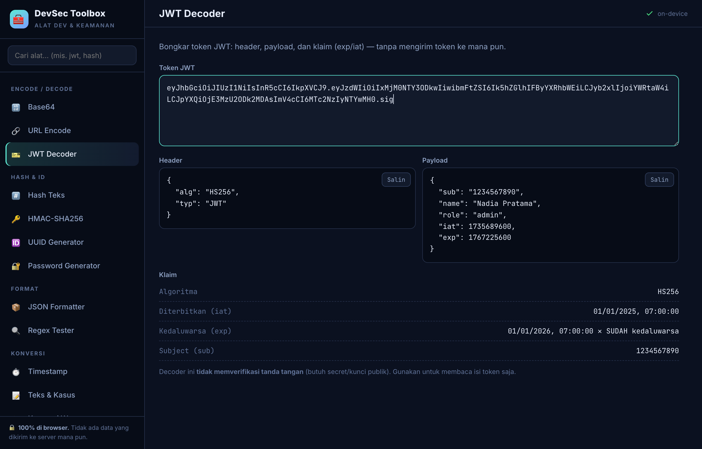
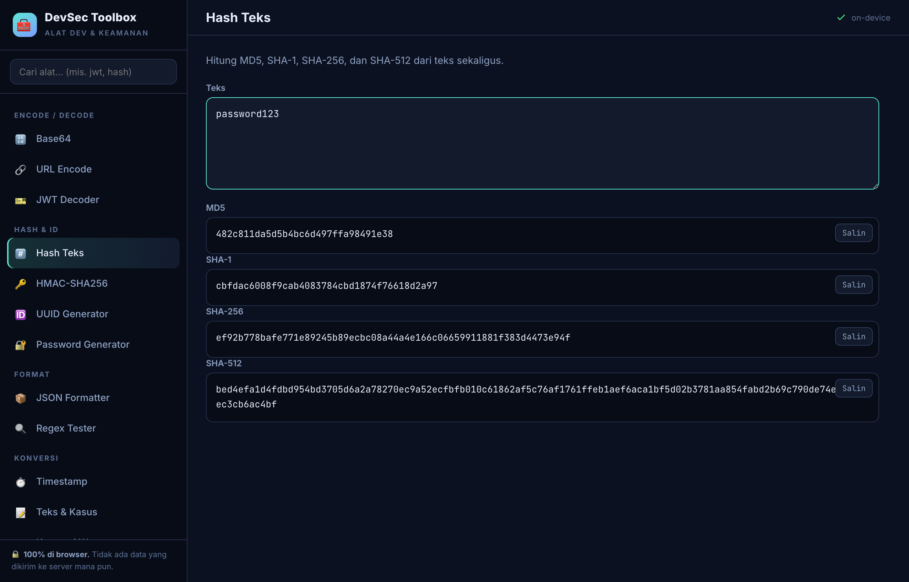

<div align="center">

# 🧰 DevSec Toolbox

### 12 alat developer & keamanan — semuanya berjalan **100% di browser**, tanpa server.

**[▶ Buka DevSec Toolbox](https://ksatriabintangsamudra.my.id/devsec/)**



</div>

---

Alat harian untuk developer, analis, dan security enthusiast — **tanpa instal, tanpa login, tanpa kirim data**. Semua diproses di perangkatmu (penting untuk data sensitif seperti token & secret).

## 🧩 Alat yang tersedia

| Grup | Alat |
|---|---|
| **Encode / Decode** | Base64 (UTF-8 & URL-safe) · URL encode/decode · **JWT Decoder** (header, payload, klaim exp/iat) |
| **Hash & ID** | Hash teks (**MD5, SHA-1, SHA-256, SHA-512** sekaligus) · **HMAC-SHA256** · UUID v4 · **Password Generator** (dengan meter entropi) |
| **Format** | JSON formatter/minify/validator · **Regex tester** (sorot kecocokan + grup) |
| **Konversi** | Unix timestamp ↔ tanggal · Teks & kasus (UPPER/camel/snake/kebab/slug, urut, uniq) · Warna (HEX ↔ RGB ↔ HSL) |

## ✨ Kenapa dipakai

- 🔒 **Privat** — token JWT, secret HMAC, dan datamu **tidak pernah meninggalkan browser**. Tidak ada request jaringan.
- ⚡ **Cepat** — satu halaman, pencarian alat, tautan langsung per alat (mis. `#jwt`).
- 🎯 **Akurat** — hash diverifikasi terhadap nilai standar (mis. `MD5("abc") = 900150983cd24fb0d6963f7d28e17f72`).
- 📱 **Responsif** — sidebar jadi drawer di ponsel.



## 🛠️ Teknologi

HTML + CSS + JavaScript **murni**, tanpa framework/dependensi. Hash SHA & HMAC memakai **Web Crypto API** (`crypto.subtle`); MD5 diimplementasi lokal; UUID & password pakai `crypto.getRandomValues`. Hosting statis di GitHub Pages.

## 💻 Menjalankan lokal

```bash
python3 -m http.server 8080     # lalu buka http://localhost:8080
```

---

<div align="center"><sub><b>DevSec Toolbox</b> · dibuat oleh <a href="https://ksatriabintangsamudra.my.id">Ksatria Bintang Samudra</a> · lisensi MIT</sub></div>
